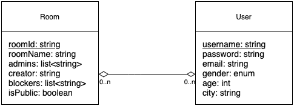
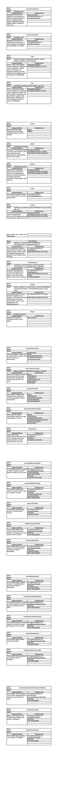

# Covey.Town

Database: 
MongoDB is used to store user information and room information. See UML for more details. During backend service starts, it connects to MongoDB by using the MongoDB URL and Mongoose is being used to help do CRUD actions to MongoDB collections.

Database UML:

The figure above indicates that the database table attributes.

CRC Cards:

Add a page for users to sign up and sign in (Home.tsx) and add a modal in the next page (Profile.tsx) for users to update their account. Create a client in the frontend and modify the existing Restful to transfer data between frontend and backend.
Add a page to help town creators regulate the town(Creator.tsx) including disconnecting a user by adding him to the blocker list and assigning a user to be administrator. Create a client in the front allowing send and retrieve creator, blockers and administrators information through calling the Mongoose library to interact with the MongoDB database to manage the above information.

Testing:
We have implemented new testing suits (file: UsersServiceClient.test.ts) in the “client” folder to test out the functions in UsersServiceClients.ts, mainly about the functionalities of adding, updating, and deleting user profiles. We have also modified the original test suits provided by professors in the file of “TownsServiceClient.test.ts”. More test units are added to test out the functionalities of adding/removing blocker, and adding/removing administrators.
